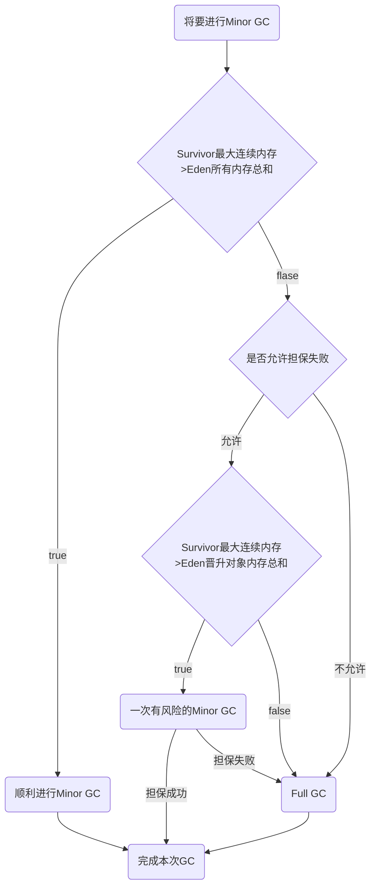

# 第三章 垃圾收集器与内存分配策略

------


[TOC]

------

## 1. 概述

那些内存需要回收?

什么时候回收?

如何回收?

​		栈中的内存大多使用在栈帧的入栈和出栈上,而每一个栈帧的内存大小基本上在类结构确定下来就是已知的,因此程序计数器,虚拟机栈,本地方法栈这几个区域的内存和回收都具备确定性.

​		而**Java堆**和方法区则不一样,接口中的多个实现类所使用的内存不一样,一个方法中的多个分支需要的内存也不一样.只有在程序运行时,才能知道会创建那些对象,**内存的分配和回收都是动态的.垃圾收集器关注的就是这部分内存.**

​		GC的数据可以通过下面的JDK自带的工具来查看:

```
jstat [Options] vmid [interval] [count]
参数:
Options，选项，我们一般使用 -gcutil 查看gc情况
vmid，VM的进程号，即当前运行的java进程号
interval，间隔时间，单位为秒或者毫秒
count，打印次数，如果缺省则打印无数次

eg:
jstat -gc 30996 3000
即：每3秒一次显示进程号为30996的java进程的GC情况
```


## 2. 对象的死亡

​		垃圾收集器在对堆进行回收前,需要先对堆中的对象确定它们是否已经**死亡(即不可能再被任何途径使用)**.

### (1).引用计数算法

​		引用计数法就是给对象添加一个计数器,每当一个地方对它进行引用时,计数加一,当引用失效时,计数减一.

​		任何时候,当一个对象的计数器为0时,这个对象就不可能再被使用.

​		但是,这种方法**无法解决对象之间相互循环引用的问题**.

### (2). 可达性分析算法

​		基本思想就是通过一系列的称为"GC Roots"的对象作为起始点,从这些节点向下搜索,搜索过程走过的路程称为引用链.当一个对象不处于任何一条引用链是,证明此对象是不可用的.

### (3). 引用

​		以上的两个算法都非常注重引用这个词.早期(JDK1.2之前)Java中引用就是指一个reference类型的数据中存储的数值代表的是另外一块内存的起始地址.后来对引用的概念进行了扩充.分为强引用(Strong Reference),软引用(Soft Reference),弱引用(Weak Reference),虚引用(Phantom Reference)四种.

#### 1). 强引用(Strong Reference)

​		强引用就是指程序代码中普遍存在的变量到对象的引用.类似`Object obj = new Object();`

​		**只要强引用还在,GC就不会回收这个对象**.

#### 2). 软引用(Soft Reference)

​		软引用来描述非必须但还可能有用的对象,**如果即将发生内存溢出,GC会清理这部分的内存**,如果清理过后还是会发生内存溢出,才会抛出异常.

#### 3). 弱引用(Weak Reference)

​		弱引用与软引用功能类似,只不过强度更弱.只能存活到下一次GC之前.**只要发生GC,就会清理弱引用**.

#### 4). 虚引用(Phantom Reference)

​		虚引用是最弱的引用关系,**唯一目的就是在这个对象被GC回收时能收到一个系统通知**.

​		一个对象是否有虚引用的存在，完全不会对其生存时间构成影响，也==无法通过虚引用来获取一个对象的实例(get()方法返回为null)==。为一个对象设置虚引用关联的唯一目的就是能在这个对象被收集器回收时收到一个系统通知。它们的不同之处在于虚引用的`get`方法始终返回`null`,弱引用可以使用`ReferenceQueue`,虚引用必须配合`ReferenceQueue`使用。

-   一般用来跟踪垃圾回收过程，在对象被垃圾回收时收到一个系统消息。程序可在收到某个虚引用对象被回收的消息 后做相应的措施。
-   ==当垃圾回收其准备回收一个对象时，如果发现这个对象存在虚引用，就会在垃圾回收前将这个对象的虚引用加入到引用队列中。==
-   可以通过检查引用队列中是否有相应的虚引用来判断对象是否被回收。
-   ==在其关联的虚引用出队之前，是不会销毁该对象的。==（使用 poll() 方法从应用队列中出队一个虚引用，虚引用出队后，与之关联的对象才可能会被销毁。==使用虚引用的目的就是为了得知对象被GC的时机，所以可以利用虚引用来进行销毁前的一些操作，比如说资源释放等。==）
-   如果一个对象没有强引用和软引用，对于垃圾回收器而言便是可以被清除的，在清除之前，会调用其finalize方法，如果一个对象已经被调用过finalize方法但是还没有被释放，它就变成了一个虚可达对象。
-   与软引用和弱引用不同，显式使用虚引用可以阻止对象被清除，只有在程序中显式或者隐式移除这个虚引用时，这个已经执行过finalize方法的对象才会被清除。想要显式的移除虚引用的话，只需要将其从引用队列中取出然后扔掉（置为null）即可。

### (4). finalize()方法

​		及时在可达性分析中不可达的对象,也并非"非死不可".

​		在可达性分析发现没有与GC Root相连之后会进行第一次标记,并进行第一次筛选(这里的筛选就是此对象是否有必要执行finalize()方法,当对象**没有覆盖finalize()方法或者已经执行过了finalize()方法**都视为没有必要执行).

​		如果判定这个对象有必要执行finalize()方法,那么这个对象就会被放置在一个F-Queue的队列中,由一个虚拟机自动创建,且优先级非常低的线程去执行这个队列中的方法.如果这个对象的finalize()方法中成功的给这个对象关联了一条引用链,那么就不会进行这个对象的垃圾回收.

​		但是,这个对象下一次被可达性分析发现没有处于引用链中,进行筛选时由于已经执行过finalize()方法,就会直接判断为没有必要执行finalize()方法.会被直接回收.

​		**任何对象的finalize()方法都只会被系统调用一次.**

### (5). 回收方法区

​		方法区(永久代)中的垃圾收集效率非常的低.主要回收两部分内容:废弃常量和无用的类.

​		对于常量来说,如果没有任何地方引用了这个常量,就说明这个常量是被废弃的,下一次GC时会进行收集,

​		而对于类,则要麻烦许多,判断条件有三点:

1.  这个类的所有实例都被回收
1.  加载这个类的ClassLoader已经被回收
1.  这个类的java.lang.Class没有被任何地方引用,无法通过反射访问这个类

​		当满足以上条件时,虚拟机就可以对这个类进行回收,仅仅是可以,不是必须.

## 3. 垃圾收集算法

### (1). 标记-清除算法

​		首先标记出所有需要回收的对象,标记完成后统一回收内存.

​		缺点有两个:**效率不高,并且清除过后会产生大量的内存碎片**.


### (2). 复制算法

​		**复制算法将内存分为两块,每次只使用一种的一块.发生GC时,将其中一块内存中可回收的部分按顺序排列好移动到另一块内存上,并切换为使用这块内存.**清理本来的那块内存.但这种方法的内存浪费未免太严重.

​		经过改进,**将内存分为三块,分别为Eden\*1和Survivor\*2,分配比例大概为Eden:Survivor1:Survivor2 = 8:1:1.每次使用Eden和其中一块Survivor.**发生GC时按照复制算法的思想将使用的两块内存上应该保持的内存移动到另一块Survivor上.清空Eden和Survivor,新使用的Survivor和已经清空的Eden作为使用中内存.

​		内存的浪费大约为10%.


### (3). 标记-整理算法

​		标记整理算法的标记过程与标记清除算法相同,不同点在于**在进行内存回收时对存活的内存进行排序处理(现将所有存活的内存移动到一端,然后直接清理掉端边界以外的内存),使被使用的内存是规整的.**


### (4). 分代收集算法

​		一般当前商业虚拟机都采用分代收集,根据对象存活周期的不同将内存划分为几块.

​		一般是将Java堆分为**新生代(防止生命周期较短的对象)和老年代(防止生命周期较长的对象)**.

​		在**新生代**中,每次垃圾收集都会有大量的对象死去,只有少量存活,选用**复制算法**.**老生代**中因为对象的存活率高,没有额外空间进行分配担保,就必须使用**标记-清理算法**或者**标记-整理算法**来进行回收.

## 4. HotSpot的算法实现

### (1). 枚举根节点

​		可达性分析需要从GC Root出发寻找死亡的对象,那么每一次GC的时候都需要堆整个内存进行扫描,寻找GC Root.旺旺比较大型的软件都有数百兆的内存,效率十分低.而且可达性分析进行的时候,必须要处于一个确保一致性的快照(相当于内存中引用不会改变的被冻结的某一时刻)中进行,导致GC时会暂停所有执行线程,会使软件的运行效率大幅度降低.

​		为解决扫描整个内存的问题,**虚拟机应当知道当前内存中那些存放的是对象引用(如果不这么做,意味着找到了这个对象的内存还需要访问这块内存,找到其中的引用)**.HotSpot虚拟机采用一组称为OopMap的数据结构达到这个目的,在类加载完成后,HotSpot就将对象内什么偏移量(成员变量)上放置的是什么对象记录下来.GC在扫描的时候，就可以根据OopMap上记录的信息准确定位到哪个区域中有对象的引用，这样大大减少了通过逐个遍历来找出对象引用的时间消耗。

​		JIT编译过程中也会在**特定位置记录下栈和寄存器(方法内部的引用)中的哪些位置是引用**.

### (2). 安全点(Safepoint)

​		每一条指令(代码编译出来叫做指令)都有可能导致引用关系发生变化,为每一条指令都生成特定的OopMap是不现实的.

​		类和对象中的引用记录在OopMap中,但上面提到了,JIT会在特定位置记录下栈和寄存器中的哪些位置是引用.这里的**特定位置就是安全点,程序只有在安全点才会停下来进行GC.**

​		安全点的选取基本上是以能否让程序长时间执行为标准,程序长时间执行,引用关系才不会在短期发生改变.

​		对于Safepoint(安全点),还需要考虑如何才能让所有线程都处于安全点上,因为GC是全局的,每一个线程都需要暂停.

有两种方案:

1.  抢断式中断:不需要代码去配合,GC发生前中断所有线程,如果发现有线程不在安全点上,恢复该线程,让它跑到安全点上.
1.  主动式中断:设置一个标识(位置就是安全点),当线程运行到这个标识时,主动中断挂起.通常采用的是这种方案.

### (4). 安全区域(Safe Region)

​		如果一个线程没有被执行,但也没在安全点(被线程锁锁住),是不是就永远无法进行GC了?

​		上面这个缺陷由安全区域完善.

​		**安全区域是指在一段代码中引用关系不会发生变化**,Safe Region可以看做是拓展了的Safepoint.

​		**当线程执行到Safe Region中时首先标识自己处于Safe Region中,这样GC时就不会再管这个线程了.当线程离开Safe Region时先判断自己是否完成了根节点枚举(或者整个GC),如果没有完成中断挂起知道收到GC完成的信号,如果没有处于GC状态,可以安全地离开.**

## 5. 垃圾收集器


基于JDK1.7 Update 14之后的HotSpot虚拟机包含以上所有收集器.

如果两个收集器间有连线,则它们可以搭配使用.

### (1). Serial收集器

​		最基本,发展历史最悠久的收集器,曾经是虚拟机新生代收集的唯一选择.复制算法.

​		单线程,这里不仅仅指它只会使用一个线程去完成垃圾收集,也指工作时必须暂停所有其他的用户线程,也就是
STW(Stop The World).

​		简单高效.

### (2). ParNew收集器

​		其实就是**Serial收集器的多线程版本**,除了使用多线程收集垃圾之外,其余的行为都与Serial收集器完全一样,包括(所有的可控参数,收集算法,STW,对象分配规则,回收策略等)

​		除了Serial收集器之外,它是唯一能与CMS(第一款真正意义上实现并发的收集器,可以同时和用户线程并行)收集器配合的收集器,而且是多线程的.所以是许多运行在Server模式下的虚拟机的首选新生代收集器.

​		单CPU环境下比Serial收集器慢.

### (3). Parallel Scavenge收集器

​		新生代收集器.使用复制算法,并行多线程.

​		其他收集器多关注尽可能缩短垃圾收集时用户线程的停顿时间.而**Parallel Scavenge收集器的目标是达到一个可控制的吞吐量**(吞吐量就是CPU用于运行用户代码的时间占总运行时间的比值,吞吐量=用户代码运行时间/(用户代码运行时间+垃圾收集时间)).**停顿时间越短越适合与用户交换,响应速度快,而高吞吐量可以高效利用CPU时间**,适合完成后台运算不需要太多的交互任务.

### (4). Serial Old收集器

​		Serial收集器的老年版本,单线程,使用标记-整理算法

### (5). Parallel Old收集器

​		Parallel Scavenge收集器的老年版本,使用多线程和标记-整理算法.同样吞吐量优先.

### (6). CMS(Concurrent Mark Sweep)收集器

​		CMS收集器是一种以获取最短回收停顿时间为目标的收集器.十分符合互联网网站或者B/S系统的服务端上.

​		基于标记-清除算法实现,运作过程分为四个步骤:

1.  **初始标记**
1.  **并发标记**
1.  **重新标记**
1.  **并发清除**

​		初始标记和重新标记仍需要STW.

​		初始标记仅仅只是**标记一下GC Root能直接关联到的对象**,速度很快.

​		并发标记阶段就是**进行GC Roots Tracing**(可达性分析算法).

​		重新标记则是**修正并发标记期间发生变动的对象标记记录**.消耗时间比初始标记稍长,但远比并发标记短.

​		并发清除就是清除内存.

当然也有3个明显的缺点:

1.  **对CPU资源十分敏感**,会占用线程导致程序变慢,当CPU不足4个的情况下可能影响程序的性能.
1.  **无法处理浮动垃圾**,可能出现"Concurrent Mode Failure"失败导致另一次Full GC的产生.并发清理阶段用户产生的垃圾成为浮动垃圾,CMS收集器无法在当前GC对其进行收集.由于垃圾回收阶段需要预留足够的空间给用户线程,所以不能等老年代几乎快被填满了才进行垃圾回收,当占用的空间已经不允许预留空间有足够大小运行用户线程,就会出现"Concurrent Mode Failure"失败,虚拟机启动后备预案:启动Serial Old收集器完成档次的老年代GC,会大幅度的占用停顿时间.
1.  标记-清除算法所产生的大量内存碎片给内存空间分配带来麻烦.当内存空间无法给对象分配内存时,会提前(这里的提前是指还有空闲内存存在,但无法利用到了)触发Full GC.可以通过参数设置执行了多次不压缩内存的GC后执行依次压缩内存的GC.

### (7). G1收集器

​		G1收集器是一款面向**服务端应用**的垃圾收集器.

特点:

1.  **并行并发.**
1.  **分代收集:可以完全的完成新生代和老年代的垃圾收集任务.**
1.  **空间整合:整体上基于标记-整理算法,聚不上基于复制算法,但无论如何,这意味着G1收集器不会产生内存碎片.**
1.  **可预测的停顿:G1除了降低停顿外,还能建立可预测的停顿时间模型,可以指定在长为M毫秒的时间内,消耗在垃圾收集上的时间不超过N毫秒.这几乎已经是实时的垃圾收集了.**

​		**G1收集器将整个Java堆分为对个大小相等的独立区域(Region),虽然还保留新生代和老年代的概念,但新生代和老年代已经不是物理隔离的了,都是一部分Region(不需要连续)的集合.**

步骤:

1.  初始标记
1.  并发标记
1.  最终标记:类似CMS的重新标记,但这个阶段是单线程的(可以并行执行)
1.  筛选回收

### (8). 理解GC日志

​		GC日志开头的"[GC"和"[Full GC"说明了这次垃圾收集的停顿类型.如果有"Full"说明本次垃圾收集发生了STW.

```
33.125 [GC [DefNew: 3324K->152k(3712K), 0.0025925 secs] 3324K->152K(11904K), 0.0031680 secs]
```

​		接下来的"[DefNew","[Tenured","[Perm"表示GC发生的区域.

​		后面方括号内3324 K->152 K(3712 K)的含义是"GC前该内存区域已使用容量->GC后使用容量(内存总容量)",而方括号之外的3324 K->152 K(11904 K)为Java堆中的内存变化.后面的时间代表该区域GC所占用的时间.

## 6. 内存分配与回收策略

​		对象的内存分配,大方向上就是在堆上分配(但也可能经JIT编译后在栈上分配),新生代分配在Eden区上,如果启动了本地线程分配缓冲,将按线程有限在TLAB(线程本地分配缓存区，这是一个线程专用的内存分配区域。)上分配.少数情况下可能直接分配在老年代上.

### (1). 对象优先在Eden分配

​		对象有限在新生代Eden上分配,如果Eden区没有足够的空间时,虚拟机将发起一次Minor GC.

>   新生代GC(Minor GC):发生在新生代的GC,比较频繁,回收速度也快.
>
>   老年代GC(Major GC/Full GC):发生在老年代的GC,一旦出现Major GC,经常会伴随至少一次的Minor GC.速度一般比Minor GC慢十倍以上.

### (2). 大对象直接进入老年代

​		大对象是指需要大量连续内存的Java对象.(很长的字符串以及数组)

### (3). 长期存活的对象将进入老年代

​		虚拟机给每一个对象定义了一个年龄计数器.如果对象在Eden出生,并**经过第一次Minor GC后仍然存活,并能被Survivor容纳的话,将被移动到Survivor空间,将年龄设置为1.每经历一次Minor GC,年龄就加一**,年龄增加到一定程度的对象就会被晋升到老年代中(通常为15岁).

### (4). 动态对象年龄判定

​		虚拟机并不是永远要求对象的年龄达到一定大小才能晋升老年代,如果Survivor空间中相同年龄所有对象大小的总和大于Survivor空间的一半,年龄大于或等于该年龄的对象就可以直接进入老年代.

​		==动态年龄判定和15岁的默认设置年龄结合使用.==

### (5). 空间分配担保

​		发生Minor GC前,虚拟机会判断Survivor空间的最大连续内存是否能放得下Eden空间中所有内存的总和(就是假设这次Minor GC让Eden中的所有对象晋升到Survivor).如果能放得下,就可以确保这次Minor GC是安全的.如综合果放不下,虚拟机会查看是否允许担保失败(参数设置).如果允许失败,虚拟机继续检查Survivor空间的连续空间是否能放的下Eden中得以晋升的对象,如果这个检查的结果是可以放得下,那么进行一次有风险的Minor GC.如果放不下或者参数设置不允许担保失败,那么进行一次Full GC.



​		这里有风险的Minor GC是指在当大量对象在Minor GC后依然存活的极端情况下,需要老年代进行分配担保,将Survivor无法放置的对象放入老年代.GC完成之前有多少对象会存活是未知的,无法确定老年代空间是否能存储的下.一般情况下是取之前GC空间的平均值,但依然有可能担保失败.一旦担保失败就会触发一次Full GC.

