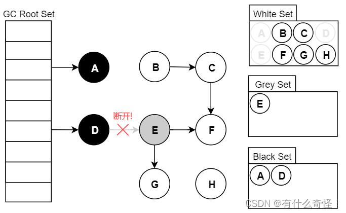
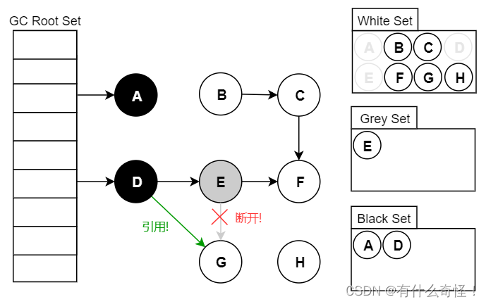
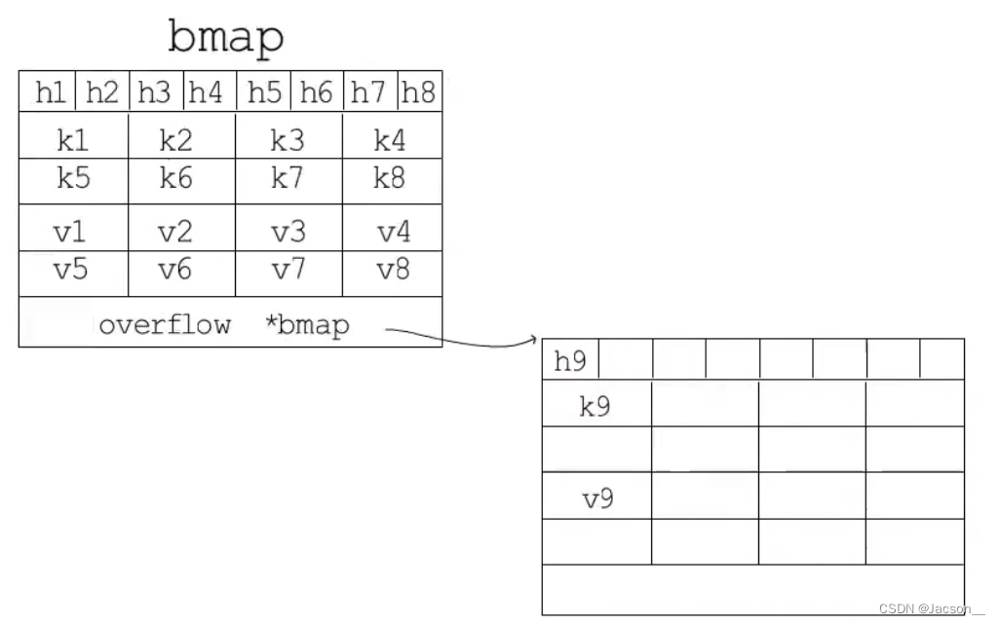

# Golang
## GMP调度模型是什么？GMP的那些参数可以影响服务的并发量

答：

GMP调度模型是Golang提供的协程调度机制，G是goroutine也就是Golang的协程，M是指machine OS内核线程，P是指processor调度器。Golang程序在启动时会根据$GOMAXPROCS创建若干个P，同时创建数量差不多的M，当没有足够数量的M来供P调度时，会创建新的M。每一个P都会有一个G0来执行调度程，同时拥有一个独占的任务队列。也存在一个全局共享的公共任务队列。

当执行go关键字启动一个goroutine时，会生成一个G（这里暂时命名为G1），加入到当前执行协程所在的独占任务队列。当该任务队列满了的时候，会取队列中队尾的一半与这个G1一起打乱放入公共队列。

当一个P不断调度任务直到独占任务队列为空时，会从公共队列中拿G。当公共队列也为空时，会从其他P的独占队列中窃取G来执行。

当当前运行的M发生了系统调用时，会执行当前的G并且释放当前关联的P，将P交给空闲的M运行。系统调用结束后，这个M会尝试获取一个P，并将执行完系统调用的G放入P的独占队列中，如果尝试获取失败，那么M进入空闲状态，P进入公共队列。

当当前运行的G超过10ms都没有主动让出CPU时，会进行调度，进入当前P独占队列的尾部。P调度独占队列头部的一个G交由M运行。

## Golang内存逃逸是什么？

答：

Golang在分配内存时，会通过逃逸分析来判断这个内存的作用域是否超出当前执行的方法范围。如果没有，则分配在栈上，否则分配在堆上。

一般我们给一个引用类对象中的引用类成员进行赋值，可能出现逃逸现象。

## Golang的GC？

答：

Golang的GC经历了几次大的更新，分别是标记清除（v1.3以前），改进的标记清除（v1.3），三色标记（v1.5，插入写屏障保证强三色不变性），混合写屏障+三色标记（v1.8）

标记清除法在执行过程中的标记以及清除过程中都需要STW，对程序的性能影响较大。

后续1.3版本通过将标记和清除分离，清除动作并不STW，优化的GC对程序的影响。但还是不够好，于是Golang在1.5版本引入了三色标记算法，降低stw的时间（可并发执行）。

三色标记的过程：1：所有的对象开始全为白色，回收器从根节点进行扫描，将扫描到的对象变为灰色。2：扫描灰色对象的集合，将扫描到的灰色对象指向的白色对象变为灰色，并将扫描到的灰色对象变为黑色。3：重复执行上一步，直到灰色对象全变为黑色对象，并将白色对象清理。

三色标记实际上还是会STW。如果不STW，那么可能会出现一些问题：

错标：当被引用的一个灰色对象被取消引用时，当前的三色标记并不会感知这个删除操作，本轮GC不会清除这个对象，会在下一轮清楚。并不严重，但会降低GC效率。



漏标：当一个对象被标记为黑色之后，又引用了新的对象时，引用的对象为白色，并且永远不会被标记到。那么这个对象会被清理。这种错误是不被允许的，因为删除了不该被删除的对象。



为了尽可能减少STW，需要解决上面的两个问题，需要了解插入屏障和删除屏障。名字起的蛮奇怪的，其实就是用AOP的机制在插入前后和删除前后做了一些处理来解决上述的两个问题。这里的使用**插入屏障在引用一个新对象时将新对象标记为灰色**，或者使用**删除屏障在删除一个引用时，如果这个对象是白色的，将其标记为灰色**。

- 强三色不变性 — 黑色对象不会指向白色对象，只会指向灰色对象或者黑色对象；
- 弱三色不变性 — 黑色对象指向的白色对象必须包含一条从灰色对象经由多个白色对象的可达路径。


在1.8版本之前，堆空间采取插入屏障解决GC并发问题，但是在栈空间中，由于一个Golang程序可能有成百上千个goroutine，在每一个goroutine都进行栈空间的插入屏障会造成非常大的开销（每个栈上都会频繁的入栈出栈）。Go 团队在实现上选择了在标记阶段完成时暂停程序、将所有栈对象标记为白色并重新扫描。
​
Golang在1.8版本引入了混合写屏障机制。该机制在进行GC时将堆区和栈区分开执行。GC时优先扫描栈空间，将所有可达的对象标记为黑色（这个过程STW，但相会会比较短）。GC 期间，任何在栈上创建的新对象，均为黑色（这里是创建时而不是变更引用时，所以开销相对并不大）。对堆区开启写屏障（也就是插入屏障+删除屏障），对所有插入和删除的对象都标记为灰色。 

## Golang中数组和切片的区别？各自的使用场景

答：

我的理解，数组是Golang提供的基础数据类型之一，是一段连续的内存，通过定义数据中元素的类型和数组的长度来确定这个内存的大小，访问时也需要根据类型来转换内存地址。切片是Golang提供的一种引用类型，本质上是一个指向一个结构体的指针类型。这个结构体的属性包含一个数组（arry），当前长度（len），当前容量（cup）。通过重新分配内部的数组以及数据的复制来达到可变长度的特点。

## Golang的map底层是如何实现的？哈希冲突如何解决？是否线程安全？每次遍历的顺序一样吗？

答：
大致的底层和Java中HashMap的实现差不多。

链地址法解决哈希冲突，底层数组的长度为2^B^（这里B为容量指数）。将key通过哈希运算的到64位的hash值，通过按位与2^B^-1（结果同取余，更高效）的到bucket（桶）的位置。

与HashMap不同的是，Golang的map中每一个bucket存储8个key-value以及下一个bucket的指针。每一个bucket的存储模式如图：按顺序存储8个tophash，8个key，8个value。其中tophash是根据key的hash值的高8位得到的。

```go

// Go map的一个header结构
type hmap struct {
    count     int // map的大小.  len()函数就取的这个值
    flags     uint8 //map状态标识
    B         uint8  // 可以最多容纳 6.5 * 2 ^ B 个元素，6.5为装载因子即:map长度=6.5*2^B
                    //B可以理解为buckets已扩容的次数
    noverflow uint16 // 溢出buckets的数量
    hash0     uint32 // hash 种子
 
    buckets    unsafe.Pointer //指向最大2^B个Buckets数组的指针. count==0时为nil.
    oldbuckets unsafe.Pointer //指向扩容之前的buckets数组，并且容量是现在一半.不增长就为nil
    nevacuate  uintptr  // 搬迁进度，小于nevacuate的已经搬迁
    extra *mapextra // 可选字段，额外信息
}
 
//额外信息
 type mapextra struct {
     overflow    *[]*bmap
     oldoverflow *[]*bmap
 ​
     nextOverflow *bmap
 }
 
 //在编译期间会产生新的结构体，bucket
 type bmap struct {
     tophash [8]uint8 //存储哈希值的高8位
     data    byte[1]  //key value数据:key/key/key/.../value/value/value...
     overflow *bmap   //溢出bucket的地址
 }
```



查：
在进行读取时，会先在当前bucket遍历tophash数组，如果找到当前tophash相同的值，那么认为通过二次hash成功，计算得到对应的key的位置，判断其值是否相等，如果不等，则访问overflow即链表上的下一个节点；如果在tophash数组中没找到当前key的tophash，也会访问下一个节点。

删：
删除元素时，会先按照查找的逻辑找到对应的位置，然后将该位置上的tophash设置为emptyOne，意为当前单元格为空，但是overflow bucket中可能还是有元素的。
然后会从后往前调整bucket，将后面没有元素的emptyOne全部替换成emptyRest

增量扩容：负载因子= 总Key数量 / 总Bucket数量。当这个值大于6.5时，会触发扩容机制。map会申请一片二倍长度的数组，使用oldbuckets指针指向原bucket数组，并且采取渐进式迁移的策略，每次访问map时，迁移两个key。当oldbuckets中的键 值对全部搬迁完毕后，删除oldbuckets。

等量迁移：当overflow数量大于2^B^，或者大于2^15^时，会触发。这种场景通常是由于key被删除导致空闲了很多overflow bucket。map的删除操作是将对应的tophash位置上的值填为empty，但位置还是占用的。所以重新迁移一遍可以解放这些位置。

## Golang的反射机制

答：

Go的反射首先将实例传递给内部的空接口，即将一个实例类型转换为接口可以表述的数据结构eface 。反射基于这个转换后的数据结构来访问和操作实例的值和类型。在Golang的实现中，每个interface变量都有一个对应的pair，pair中记录了实际变量的值（value）和类型（type）

## Golang的defer的用法？为什么这么设计？什么时候被触发？

答：

defer是Golang提供的一种延迟调用机制。defer会将后面需要执行的方法链接在当前goroutine的_defer链表的头节点。方法退出时，会从头往尾执行这些方法。

defer用于释放资源，锁等场合，避免程序panic导致后续业务代码未执行到。

有一个事实必须要了解，关键字return不是一个原子操作，实际上return只代理汇编指令ret，即将跳转程序执行。return i，实际上分两步进行，即将i值存入栈中作为返回值，然后执行跳转，而defer的执行时机正是跳转前，所以说defer执行时还是有机会操作返回值的。

https://www.qycn.com/xzx/article/7701.html

## Golang的可变参数

答：
可变参数是Golang提供的一个语法糖，允许在定义方法时用...代替多个相同类型的参数。在调用出传入多个该类型的参数即可。方法中则将这个字段看作一个切片。

```go
package mai
import "fmt"

func sum(arr ...int) int {
    sum := 0
    for _, v := range arr {
        sum += v
    }
    return sum
}

func main() {
    fmt.Println(sum(1, 2, 3, 4, 5, 6, 7, 8, 9))
}
```


## Golang是如何实现`a, b = b, a`的

答：
多重赋值是Golang提供的一个语法糖，编译器替我们拆分了赋值语句。对于a, b = b, a这种代码编译器替我们创建了中间变量。

```go
a := 1
b := 2
a, b = b, a
========= 等价 =========
aTemp = a
bTemp = b
a = bTemp
b = aTemp
```


## Golang的方法为什么通常都需要返回一个error？

答：

显示的返回错误可以提醒调用者处理。

## Golang结构体tag的使用场景，json的tag如何写可以忽略该字段？

答：
JSON Tag标签格式为：`json:"FieldName/-/可选,omitempty/可选,string/可选`

- FieldName选项：指定编码后键名称
  - 可为空，则使用Struct对应字段名作为JSON输出名
  - FieldName非空，则使用指定的FieldName作为JSON输出名
  - -符号，输出时忽略此字段；但要注意-,（多一个逗号结尾）时，输出字段名为-的JSON字段，而不是忽略
- omitempty选项：忽略空值
  - 包含此选项，输出时字段空值（零值+空值：false、0、nil指针、nil接口值，以及任何空数组、切片、map或字符串）则不输出
- string选项：结果输出为字符串
  - 字段结果输出为字符串
  - 只适用于字符串、浮点、整数或布尔类型的字段
  - 这种额外的编码有时在与 JavaScript 程序通信时使用
  - 要注意，如果字段值本身为string时，再次增加JSON的string标签选项，会导致多个引号的情况

```go
package main

import (
    "fmt"
    "reflect"
)

type Person struct {
    Name        string `label:"Person Name: " uppercase:"true"`
    Age         int    `label:"Age is: "`
    Sex         string `label:"Sex is: "`
    Description string
}

func main() {
    p := &Person{}
    tag := reflect.ValueOf(p).Type().Elem().Field(0).Tag
    t := tag.Get("label")
    fmt.Println(t)
}
```


## Golang的有缓冲channel和无缓冲channel的区别？

答：
无缓冲的channel在写入值时就会阻塞，直到另一个goroutine从这个channel中读取，才会写入成功。
而对于有缓冲区的channel，写入值可以先暂存在channel中，不需要立刻读取。
暂时无法在飞书文档外展示此内容
“空读写阻塞，写关闭异常，读关闭空零”：向为nil的channel读写数据会阻塞，向已经关闭的channel写入数据会panic，读取会读一个零值。

## 如何写一个并发

答：https://github.com/Benjaminlii/go_some_learning/blob/main/utils/sync/goroutine.go

## Golang如何比较两个结构体、slice完全一样？

答：

对于基本数据类型，例如int和string等，使用\=\=进行判断即可。

slice和Map可以使用\=\=nil来判空，但不能判断两个引用的相等。如果要判断两个slice、map或者结构体呢诶容是否一致时，可以使用reflect.DeepEqual()或者cmp.Equal()。

## Golang中make和new的区别

答：

new返回一个指向某个类型零值的指针，make只能对map和slice使用，会分配内存并且返回引用类型本身。

## Golang中timer和ticker的区别

答：

timer和ticker都是Golang中time包下提供的计时器。他们的区别是timer是一次性计时器，到一定时间后触发一次；而ticker是周而复始的，每过一定的时间，就触发一次。

他们内部都有一个C channel，当需要触发计时器时，timer/ticker会往C中写入一个触发时刻的time对象。

并不是每一个timer/ticker都会启动一个goroutine去计时。Golang有64个系统协程管理所有的timer/ticker，每一个系统协程通过四叉堆维护其所管理的timer/ticker。

## Golang和Java区别，各自特点，使用优缺点-------

答：

在语法风格上面，Golang更简洁也更加严格，推崇统一一致的实现方式，Java相对比较繁琐，自由程度更高。比如Golang不需要显式声明对接口的实现，更简洁；Golang不允许声明不被使用的变量，更严格。

Golang中没有继承和多态的概念。结构体可以使用组合（在一个结构体中引入另一个结构体）来实现字段和方法的复用。

Golang有指针的概念，Java没有（但也可以理解Java每一个对象都是指针）。

Golang编译产物是二进制文件，理论上运行效率高，但不跨平台。Java编译产出的字节码文件还需要JVM来运行，运行相对效率低，但编译产物可跨平台。

Golang的并发使用协程来实现，对系统开销相对较小，并发效率也更高。Java这方面相对逊色一些。
