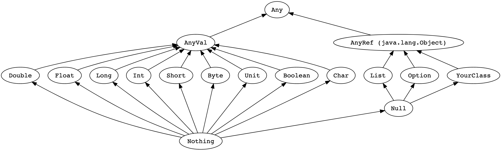

# Scala语法以及Hello World

[TOC]

---

## 介绍

```
我：
    介绍下scala
ChatGPT：
    Scala 是一种多范式编程语言，可以支持面向对象编程和函数式编程。它是由 Martin Odersky 在2003年开发的，旨在结合 Java 的强大生态系统和功能丰富的编程模型，同时提供更简洁、更灵活的语法和功能。
    Scala 主要特点包括：
        面向对象和函数式编程：Scala 允许开发人员使用面向对象和函数式编程风格编写代码，这使得它既能使用传统的面向对象设计模式，也能利用函数式编程的优势，如不可变数据和高阶函数。
        静态类型系统：Scala 具有强大的静态类型系统，可以在编译时捕获许多常见的错误，提高代码的可靠性和安全性。
        表达力强大：Scala 的语法简洁而灵活，支持高阶函数、模式匹配、类型推断等功能，使得开发人员能够用更少的代码实现更多的功能。
        与 Java 互操作性：Scala 可以与 Java 无缝集成，可以直接调用 Java 类库，也可以被 Java 代码调用，这使得 Scala 成为了一个很好的 Java 的补充，尤其是在大型项目中。
        并发支持：Scala 提供了丰富的并发支持，包括 Actor 模型、并发集合等，使得开发人员能够更轻松地编写并发程序。
    总的来说，Scala 是一种功能强大、表达力高的编程语言，适用于各种场景，包括 Web 开发、大数据处理、并发编程等。
```

>   题外话：
>
>   函数式编程可以被认为是面向对象编程的对立面。
>
>   对象就像是颗小胶囊，包裹着内部状态和随之而来的能让你修改这个内部状态的一组调用方法，以及由正确的状态变化所构成的程序。
>
>   函数式编程希望尽可能地消除状态变化，只和流经函数的数据打交道。

## 安装Scala

```shell
brew update
brew install scala
```

命令行输入`scala`就能进入scala的交互式环境。

## 基本语法

### 表达式

表达式是可执行的语句

```scala
1                      // 1
1 + 1                  // 2
"Hello!"               // Hello!
"Hello," + " world!"   // Hello, world!

// 使用 `val` 关键字声明常量
val a = 1 + 1
a = 3 // 会报错

// 使用 var 关键字声明一个变量
var num = 1 + 1
num = 3

上述声明都是用了类型推断，也可以显式的声明类型
var num: Int = 1 + 1
```

### 代码块

几个表达式组合起来用`{}`包起来称为代码块，代码块的最后一个表达式的结果是整个代码块的值

```scala
println({
  val x = 1 + 1
  x + 1
}) // 3
```

### 函数

函数即是带参数的表达式

```scala
// 匿名函数
(x: Int, y: Int) => x + y

// 函数可以被赋值给一个变量或者常量
val add (x: Int, y: Int) => x + y
```

### 方法

方法由`def`关键字定义， `def`后跟着名字、参数列表、返回类型和方法体。

方法体的最后一个表达式就是方法的返回值。（Scala中也有一个`return`关键字，但是很少使用）

```scala
def add(x: Int, y: Int): Int = {
    x + y
}

// 参数列表可以有多个也可以没有
def addAndCheck(x: Int, y: Int)(num: Int): Boolean = {
    x + y == num
}
println(addAndCheck(1, 2)(3)) // True

def getANullString: String = {
    ""
}
println(getANullString) // ""
```

### 类

可以使用`class`关键字定义一个类， 后面是其名字和构造参数。

`unit`类型类似`Java`中的`void`表示没有值。

```scala
class Person(name: String, age: Int) {
    def helloAndSaySomething(something: String):Unit = {
        println(s"hello, I'm $name, $age years old, $something")
    }
}

val benjamin = new Person("Benjamin", 25)
benjamin.helloAndSaySomething("how are you?") // hello, I'm Benjamin, 25 years old, how are you?
```

### 样例类

样例类(case class)是Scala的一种特殊的类， 一般用于不可变对象，并且可作值比较。可以使用`case class`关键字来定义样例类。

```scala
case class Point(x: Int, y: Int)

val point = Point(1, 2)
val anotherPoint = Point(1, 2)
val yetAnotherPoint = Point(2, 2)

if (point == anotherPoint) {
  println(1)
} else {
  println(2)
} // 1

if (point == yetAnotherPoint) {
  println(1)
} else {
  println(2)
} // 2
```

### 对象

对象相当于自己定义的一个单实例的类，可以使用`object`关键字定义对象。

```scala
object IdFactory {
    private var count = 0
    def create(): Int = {
        count+=1
        count
    }
}
println(IdFactory.create()) // 1
println(IdFactory.create()) // 2
```

### 特质

特质是一种包含一些字段和方法的类型，个人理解可以类比接口。可以使用`trait`关键字定义一个特质。

特质不能被实例化，因此特质没有参数。

```scala
trait Person {
    // 特质的方法可以有默认的实现，也可以只进行定义
    def hello(): Unit = {
        println(s"Hello")
    }
}

// 可以使用 `extends` 关键字继承特质， 使用 `override` 关键字覆盖其默认实现
class Chinese(name: String) extends Person {
    override def hello(): Unit = {
        println(s"你好， 我是$name")
    }
}
```

这里只继承了一个特质，Scala是支持对特质的多继承的。

### 主方法

主方法是程序的入口点，由JVM要求一个名为main的主方法，接受一个字符串数组作为参数。

```scala
object Main {
    def main(args Array[String]): Unit = {
        println("Hello World!")
    }
}
```

## 统一类型

### 层次结构



上图是Scala基本类型的层次结构。

`Any`是所有类型的超类型，也称为顶级类型。它定义了一些通用的方法如`equals`、`hashCode`和`toString`。`Any`有两个直接子类：`AnyVal`和`AnyRef`。

`AnyVal`代表值类型。有9个预定义的非空的值类型分别是：`Double`、`Float`、`Long`、`Int`、`Short`、`Byte`、`Char`、`Boolean`和`Unit`。`Unit`是不带任何意义的值类型，它仅有一个实例可以像这样声明：`()`。所有的函数必须有返回，所以说有时候`Unit`也是有用的返回类型。

`AnyRef`代表引用类型。所有非值类型都被定义为引用类型。在Scala中，每个用户自定义的类型都是`AnyRef`的子类型。如果Scala被应用在Java的运行环境中，`AnyRef`相当于`java.lang.Object`。

与Java不用Double, Int等基本类型在Scala中也是对象

### 类型转换
