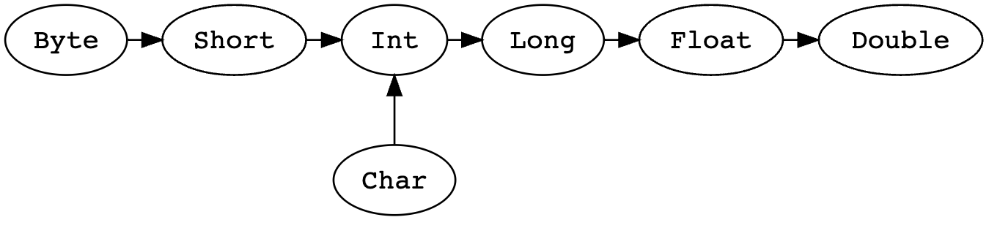

# Scala语法以及Hello World

[TOC]

---

## 介绍

```
我：
    介绍下scala
ChatGPT：
    Scala 是一种多范式编程语言，可以支持面向对象编程和函数式编程。它是由 Martin Odersky 在2003年开发的，旨在结合 Java 的强大生态系统和功能丰富的编程模型，同时提供更简洁、更灵活的语法和功能。
    Scala 主要特点包括：
        面向对象和函数式编程：Scala 允许开发人员使用面向对象和函数式编程风格编写代码，这使得它既能使用传统的面向对象设计模式，也能利用函数式编程的优势，如不可变数据和高阶函数。
        静态类型系统：Scala 具有强大的静态类型系统，可以在编译时捕获许多常见的错误，提高代码的可靠性和安全性。
        表达力强大：Scala 的语法简洁而灵活，支持高阶函数、模式匹配、类型推断等功能，使得开发人员能够用更少的代码实现更多的功能。
        与 Java 互操作性：Scala 可以与 Java 无缝集成，可以直接调用 Java 类库，也可以被 Java 代码调用，这使得 Scala 成为了一个很好的 Java 的补充，尤其是在大型项目中。
        并发支持：Scala 提供了丰富的并发支持，包括 Actor 模型、并发集合等，使得开发人员能够更轻松地编写并发程序。
    总的来说，Scala 是一种功能强大、表达力高的编程语言，适用于各种场景，包括 Web 开发、大数据处理、并发编程等。
```

>   题外话：
>
>   函数式编程可以被认为是面向对象编程的对立面。
>
>   对象就像是颗小胶囊，包裹着内部状态和随之而来的能让你修改这个内部状态的一组调用方法，以及由正确的状态变化所构成的程序。
>
>   函数式编程希望尽可能地消除状态变化，只和流经函数的数据打交道。

https://docs.scala-lang.org/zh-cn/

## 安装Scala

```shell
brew update
brew install scala
```

命令行输入`scala`就能进入scala的交互式环境。

## 基本语法

### Scala包

#### 包的定义

Scala通过package关键字定义包：

```scala
// 与Java一样在文件头中定义包，文件内的所有代码都属于这个包
package com.packagename
class HelloWorld

// 这种方法可以在一个文件中定义多个包
package com.packagename {
  class HelloWorld 
}
```

#### 引用

Scala 使用 import 关键字引用包。

```scala
// 引入一个包中的所有内容
import scala.math._

// 引入某个包的一个元素
import scala.math.Pi

// 引入一个包中的多个元素
import scala.math.{Pi, E}

// 引入并重命名
import java.util.{HashMap => JavaHashMap}

// 引入一个包中的所有元素，隐藏其中的某个元素
import java.util.{HashMap => _, _}
```


### 类型

#### 层次结构


上图是Scala基本类型的层次结构。

`Any`是所有类型的超类型，也称为顶级类型。它定义了一些通用的方法如`equals`、`hashCode`和`toString`。`Any`有两个直接子类：`AnyVal`和`AnyRef`。

`AnyVal`代表值类型。有9个预定义的非空的值类型分别是：`Double`、`Float`、`Long`、`Int`、`Short`、`Byte`、`Char`、`Boolean`和`Unit`。`Unit`是不带任何意义的值类型，它仅有一个实例可以像这样声明：`()`。所有的函数必须有返回，所以说有时候`Unit`也是有用的返回类型。

`AnyRef`代表引用类型。所有非值类型都被定义为引用类型。在Scala中，每个用户自定义的类型都是`AnyRef`的子类型。如果Scala被应用在Java的运行环境中，`AnyRef`相当于`java.lang.Object`。

与Java不用Double, Int等基本类型在Scala中也是对象

#### 类型转换

值类型可以按照下面的方向进行转换：



#### Nothing 和 Null

Nothing是所有类型的子类型，不存在这个类型的值。其用途之一是给出非正常终止的信号。

Null是所有引用类型的自类型。主要用途是让Scala满足和其他JVM语言的互操作性，一般不使用。


### 变量

```scala
// scala中分别使用val和var声明常量和变量
// 声明格式如下：
// var v: Type [= Value]
var name: String = "Benjamin"

// 如果声明了初始值，则可以省略Type，Scala会根据类型推断判断类型
var name = "Benjamin"

// Scala支持多变量声明
var name, age = "Benjamin", 25
```

### 分支与循环

#### if, else, do, while, for, yield

```scala
// 分支和循环语句和Java大部分一致

// if语句语法
if(布尔表达式){
   // code1
} else if(布尔表达式 2){
   // code2
} else {
   // code3
}

// while 循环
while(布尔表达式){
   // do something
}

// do while循环
do {
   // do something
} while(布尔表达式);

// for循环和Java不一样
// Range 可以是一个数字区间表示 i to j ，或者 i until j
// to 和 until 的区别在于，to包含j，until不包含j
for(x <- Range){
   // do something
}

// for循环集合
// List 变量是一个集合，for 循环会迭代所有集合的元素。
for( x <- List ){
   // do something
}

// for循环过滤
// 在for循环集合的基础上，只有当循环到的元素满足所有布尔表达式时，才会进入循环
for( x <- List
      if 布尔表达式1; if 布尔表达式2...
   ){
   statement(s);
}

// yield关键字将for循环中的每次迭代产生的值收集起来，并返回一个新的集合
var retVal = for( x <- List
      if 布尔表达式1; if 布尔表达式2...
)yield x


var l = List(1,2,3,4,5,6,7,8,9,10);
var retVal = for( x <- l
      if x%2 == 0
)yield x
println(retVal)
```

#### 模式匹配

Scala 提供了强大的模式匹配机制， 通过match-case关键字定义。

只要发现有一个匹配的case，剩下的case不会继续匹配。

```scala
// 语法
被匹配对象 match {
    case 匹配项1 => 返回结果
    case 匹配项2 => 返回结果
    case _ => 匹配失败返回结果
}
```


### 方法与函数

#### 表达式

表达式是可执行的语句

```scala
1                      // 1
1 + 1                  // 2
"Hello!"               // Hello!
"Hello," + " world!"   // Hello, world!

// 使用 `val` 关键字声明常量
val a = 1 + 1
a = 3 // 会报错

// 使用 var 关键字声明一个变量
var num = 1 + 1
num = 3

上述声明都是用了类型推断，也可以显式的声明类型
var num: Int = 1 + 1
```

#### 代码块

几个表达式组合起来用`{}`包起来称为代码块，代码块的最后一个表达式的结果是整个代码块的值

```scala
println({
  val x = 1 + 1
  x + 1
}) // 3
```

#### 函数

函数即是带参数的表达式。

```scala
// 匿名函数
(x: Int, y: Int) => x + y

// 函数可以被赋值给一个变量或者常量
val add (x: Int, y: Int) => x + y
```

#### 方法

>   Scala 有方法与函数，二者在语义上的区别很小。Scala 方法是类的一部分，而函数是一个对象可以赋值给一个变量。换句话来说在类中定义的函数即是方法。

方法由`def`关键字定义， `def`后跟着名字、参数列表、返回类型和方法体。

方法体的最后一个表达式就是方法的返回值。（Scala中也有一个`return`关键字，但是很少使用）

```scala
def add(x: Int, y: Int): Int = {
    x + y
}

// 参数列表可以有多个也可以没有
def addAndCheck(x: Int, y: Int)(num: Int): Boolean = {
    x + y == num
}
println(addAndCheck(1, 2)(3)) // True

def getANullString: String = {
    ""
}
println(getANullString) // ""

// 命名参数
def printName(first: String, last: String): Unit = {
  println(first + " " + last)
}
printName("John", "Smith")  // Prints "John Smith"
printName(first = "John", last = "Smith")  // Prints "John Smith"
printName(last = "Smith", first = "John")  // Prints "John Smith"
printName(last = "Smith", "john") // Error

```

#### Scala 闭包

闭包是一个函数，返回值依赖于声明在函数外部的一个或多个变量。

闭包通常来讲可以简单的认为是可以访问一个函数里面局部变量的另外一个函数。

```scala
var n = 10
val mul = (i: Int) => i * n
println(mul(3)) // 30
```

### 基本数据结构

#### 数组

```scala
// 声明数组
var z = new Array[String](3)
or
var z = Array("a", "b", 1)

// 与很多语言不同，通过下标访问数组的元素，需要使用()
println(z(0)) // a

// 下面调用了Array包的方法，需要导入
import Array._

// 多维数组的定义
val myMatrix = Array.ofDim[Int](3, 3)
var myMatrix1 = Array(
    Array(1, 2, 3),
    Array(1, 2, 3),
    Array(1, 2, 3)
)

// 合并数组
var myList1 = Array(1, 2, 3)
var myList2 = Array(4, 5, 6)
var myList3 = concat( myList1, myList2)
for(i <- myList3){
    print(i)
}
// 123456

// 区间数组，可用于for循环，参数12为区间边界（左闭右开），参数3为步长
var myList1 = range(10, 20, 2)
for ( x <- myList1 ) {
    print( " " + x )

}
// 10 12 14 16 18
```

#### 集合

List列表

```scala
// List声明
// 个人理解， scala中的List是一个链表，所以有这些特性（头插，取第一个元素）
// 因为 List 是一个链表，不应该尝试通过索引值来访问大列表的元素。如果希望通过索引访问元素，改用 Vector 或 ArrayBuffer。
// List 是不可变的，这意味着一旦创建了列表，就不能更改它的内容。任何看似修改列表的操作实际上都会创建一个新的列表。
// Nil是Scala中的一个空List实例
// ::是scala中创建List的操作符
val nums: List[Int] = List(1, 2, 3, 4)
val nums = 1 :: 2 :: 3 :: 4 :: Nil

// 基本操作
// head 返回第一个元素
println(nums.head)    // 1
// tail 返回除第一个元素外的列表
println(nums.tail)    // List(2, 3, 4)
// isEmpty 列表判空
println(nums.isEmpty) // false
println(nums.isEmpty) // false

// 连接List
// :::是scala中连接List的操作符，也可以使用List.:::() 方法或 List.concat() 方法
val list1 = List(1, 2)
val list2 = List(3, 4)
println(list1 ::: list2)           // List(1, 2, 4, 5)
println(list1.:::(list2))          // List(1, 2, 4, 5)
println(List.concat(list1, list2)) // List(1, 2, 4, 5)

// 构建重复列表
// List.fill(repeat)(list) 该方法可以构造一个list列表重复repeat次的列表
val list = List.fill(5)(1,2,3) // List((1,2,3), (1,2,3), (1,2,3), (1,2,3), (1,2,3))

// 通过给定函数构建列表
// List.tabulate(dimension1, dimension2 ...)(index1, index2 ... => targetValue)
val list = List.tabulate(6)(index => index * index) // List(1, 2, 4, 9, 16, 25)
val list = List.tabulate(4, 5) ( (row, col) => row * col )
// List((0, 0, 0, 0, 0),
//      (0, 1, 2, 3, 4),
//      (0, 2, 4, 6, 8),
//      (0, 3, 6, 9, 12))
```

Set集合

```scala
// Set声明
// scala中默认的Set是不可变的，一经声明不可变，虽然可以增减元素但实际上是生成了新的Set
// 要使用可变集合需要 import scala.collection.mutable.Set
import scala.collection.mutable.Set

val set = Set(1,2,3)

// 基本操作和List相同 略

// 连接集合
val set1 = Set("a", "b", "c")
val set2 = Set("c", "d", "e")
println(set1 ++ set2)  // Set("a", "b", "c", "d", "e")
println(set1.++(set2)) // Set("a", "b", "c", "d", "e")

// 最值
val s = Set(1, 5, 0, -10)
println(s.min) // -10
println(s.max) // 5

// 交集
println(set1.&(set2))         // Set("c")
println(set1.intersect(set2)) // Set("c")
```

Map映射

```scala
// 默认情况下 Scala 使用不可变 Map
// 使用可变集合需要 import scala.collection.mutable.Map

val map = Map("a" -> 1, "b" -> 2)

// 基本操作
// 得到所有key
println(map.keys) // Set("a", "b")
// 得到所有value
println(map.values) // Set(1, 2)

// 访问元素
println(map("a")) // 1

// 更新Map
map = map + ("c" -> 3)
map("c") = 3 // 可变Map

// 删除key
map = map - "a"
map.remove("a") // 可变Map

// 合并
val map1 = Map("a" -> 1, "b" -> 2)
val map2 = Map("b" -> 3, "c" -> 4)
println(map1 ++ map2)  // Map("a" -> 1, "b" -> 3, "c" -> 4)
println(map1.++(map2)) // Map("a" -> 1, "b" -> 3, "c" -> 4)
```

元组

```scala
// Scala中元组是一系列不可变的，可以容纳多个元素的类，分别是Tuple2 - Tuple22
val t = (1, 3.14, "Fred")
val t = new Tuple3(1, 3.14, "Fred")

// 使用下划线+下标访问元组中的元素
println(t._2) // 3.14

// 解构元组
val (a, b) = t
```


### 类

#### 定义类

可以使用`class`关键字定义一个类， 后面是其名字和构造参数。

`unit`类型类似`Java`中的`void`表示没有值。

```scala
class Person(name: String, age: Int) {
    def helloAndSaySomething(something: String):Unit = {
        println(s"hello, I'm $name, $age years old, $something")
    }
}

val benjamin = new Person("Benjamin", 25)
benjamin.helloAndSaySomething("how are you?") // hello, I'm Benjamin, 25 years old, how are you?
```

#### 访问修饰符

Scala 访问修饰符基本和Java的一样，分别有：private，protected，public。

如果没有指定访问修饰符，默认情况下，Scala 对象的访问级别都是 public。

-   私有(Private)成员: 用 private 关键字修饰，带有此标记的成员仅在包含了成员定义的类或对象内部可见
-   保护(Protected)成员: 只允许保护成员在定义了该成员的的类的子类中被访问
-   公共(Public)成员: 如果没有指定任何的修饰符，则默认为 public。这样的成员在任何地方都可以被访问。

#### 构造

在Scala中，构造方法的概念与Java等其他面向对象的编程语言有所不同。

Scala中的对象创建和初始化主要依赖于主构造器和辅助构造器，以及参数列表的概念。

```scala
// 主构造器通过参数列表定义，带有var或者val的参数是共有的，否则是私有的
class Person(val name: String, age: Int) {
    // 辅助构造器
    def this() = {
        this("John", 20) // 调用主构造器，设置默认值
    }
    // 辅助构造器
    def this(name: String) = {
        this(name, 18) // 调用主构造器，为 lastName 设置默认值
    }
}

// 单实例对象
object Person {
    def apply(name: String, age: Int): Person ={
        new Person(name, age)
    }
}

// 调用主构造器
val person1 = new Person("Benjamin", 25) // Person("Benjamin", 25)
// 调用辅助构造器
val person2 = new Person("Jack") // Person("Jack", 18)
// 使用单实例对象+伴生方法，不需要new关键字
val person3 = Person("Bob", 24) // Person("Bob", 24)
```


#### 私有成员和get/set方法

```scala
// 成员变量默认是公有的，private关键字可以限制其为私有
class People{
    var _name = ""
    private var _age = 0
    
    // get方法
    def age = _age
    // set方法
    // 默认参数值为0
    def age_= (age: Int = 0): Unit = {
        if (age >= 0){
            _age = age
        }else{
            println("error")
        }
    }
}
val p = new People
p.age = 20
p.age = -1 // will print error
```

#### 继承

Scala 使用 extends 关键字来继承一个类，只允许继承一个父类。

Scala重写一个非抽象方法，必须用override修饰符。

```scala
class People{
    var name = ""
    def f :String = {
        s"name: $name"
    }
}
```


#### 样例类

样例类(case class)是Scala的一种特殊的类， 一般用于不可变对象，并且可作值比较。可以使用`case class`关键字来定义样例类。

在声明样例类时，会自动附加这些属性：

-   每个参数都成为val，除非显式被声明为var，但是并不推荐这么做
-   在伴生对象中提供了apply方法，所以可以不使用new关键字就可构建对象
-   提供unapply方法使模式匹配可以工作
-   生成toString、equals、hashCode和copy方法，除非显示给出这些方法的定义

```scala
case class Person(name: String, age: Int)

val alice = new Person("Alice", 25)
val bob = new Person("Bob", 32)
val charlie = new Person("Charlie", 32)

for (person <- List(alice, bob, charlie)) {
    person match {
        case Person("Alice", 25) => println("Hi Alice!")
        case Person("Bob", 32) => println("Hi Bob!")
        case Person(name, age) => println("Age: " + age + " year, name: " + name + "?")
    }
}
```

#### 单例对象

对象相当于自己定义的一个单实例的类，可以使用`object`关键字定义对象。

```scala
object IdFactory {
    private var count = 0
    def create(): Int = {
        count+=1
        count
    }
}
println(IdFactory.create()) // 1
println(IdFactory.create()) // 2
```

#### 特质

特质是一种包含一些字段和方法的类型，个人理解可以类比接口。可以使用`trait`关键字定义一个特质。

特质不能被实例化，因此特质没有参数。

```scala
trait Person {
    // 特质的方法可以有默认的实现，也可以只进行定义
    def hello(): Unit = {
        println(s"Hello")
    }
}

// 可以使用 `extends` 关键字继承特质， 使用 `override` 关键字覆盖其默认实现
class Chinese(name: String) extends Person {
    override def hello(): Unit = {
        println(s"你好， 我是$name")
    }
}
```

这里只继承了一个特质，Scala是支持对特质的多继承的。

### 异常处理

```scala
// Scala 抛出异常的方法和 Java一样，使用 throw 方法
throw new IllegalArgumentException

// Scala 也通过try-catch捕获异常，只不过catch中使用case（模式匹配）来匹配错误
// 异常捕捉按次序执行，所以要考虑异常的继承关系
try {
    val f = new FileReader("input.txt")
} catch {
    case ex: FileNotFoundException =>{
        println("Missing file exception")
    }
    case ex: IOException => {
        println("IO Exception")
    }
} finally {
    println("Exiting finally...")
}
```


### 主方法

主方法是程序的入口点，由JVM要求一个名为main的主方法，接受一个字符串数组作为参数。

```scala
// vim HelloWorld.scala
object HelloWorld {
    def main(args: Array[String]): Unit = {
        println("Hello, world!")
    }
}

// scalac HelloWorld.scala
// scala HelloWorld
```


