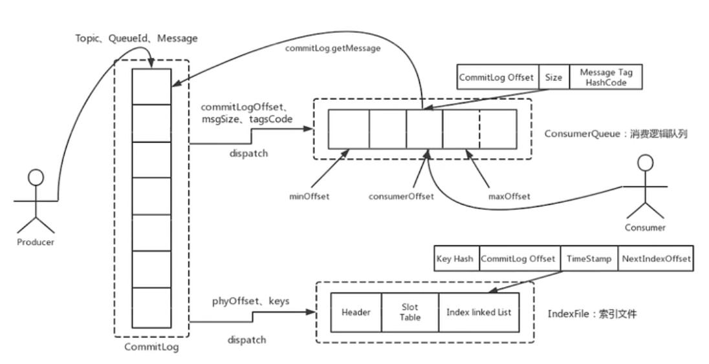
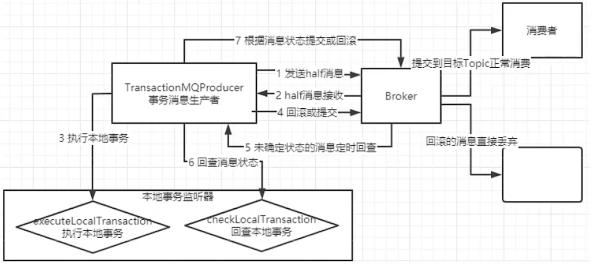

# rocketMQ

## rocketMQ的事务

答：
	rocketMQ的事物通过两阶段提交实现。
	rocketMQ的事务消息生产者可以绑定一个本地事务监听器，具有执行本地事务和回查两个方法。当生产端需要执行事务时，首先会向Mq发送一个半消息。mq收到半消息会调用注册的执行方法。此时这个消息还不能背消费者消费。当本地事务返回unknow时，会进行回查。返回commit时提交事务将半消息提交为完整消息，返回rollback时回滚事务。
	rocketMQ会定期回查存储在mq中的未提交事务。

## rocketMQ如何做到顺序消费？局部有序？全局有序？

答：
	可以通过QueueSelector将需要保证局部有序的消息发到同一个Queue中，Queue内部由于是FIFO的队列，能保证消息的顺序。
	实现全局有序则可以只启动一个Queue，将全部消息都发到一个队列中，不过性能会差很多。

## rocketMQ可以保证消息不丢失吗？

答：
	可以。
	首先在发消息阶段，同步发送有返回值，异步发送有回调来接收是否发送成功。
	在rocketMq中，发送来的消息都会写入CommitLog文件，broker中维护了ConsumerQueue（多对一的对应一个Topic），其中存储的节点中包含指向一条消息的指针
	另外还维护了一个IndexFile文件，用来存储了发送时间等辅助信息来做筛选。

	既然维护了文件存储，那么就需要考虑内存写入磁盘的机制。rocketMq提供了同步刷盘和异步刷盘两种方式。同步刷盘即用户send请求中，rocketmq会将信息写入内存，然后写入磁盘，写入成功后才返回。异步刷盘在信息写入内存中就会返回，由另一个线程将内存中的数据异步写入磁盘。那么很显然，同步刷盘的方式能避免宕机导致的数据丢失，异步刷盘不可以。

