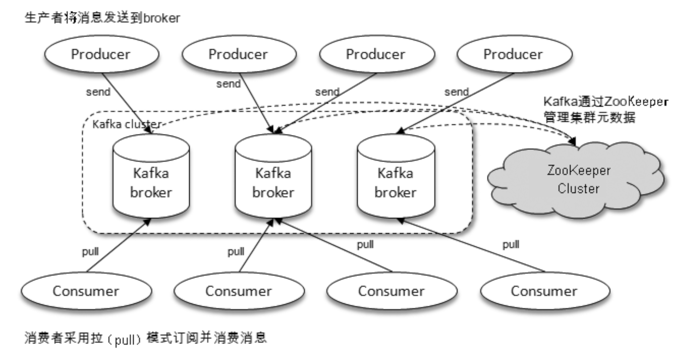
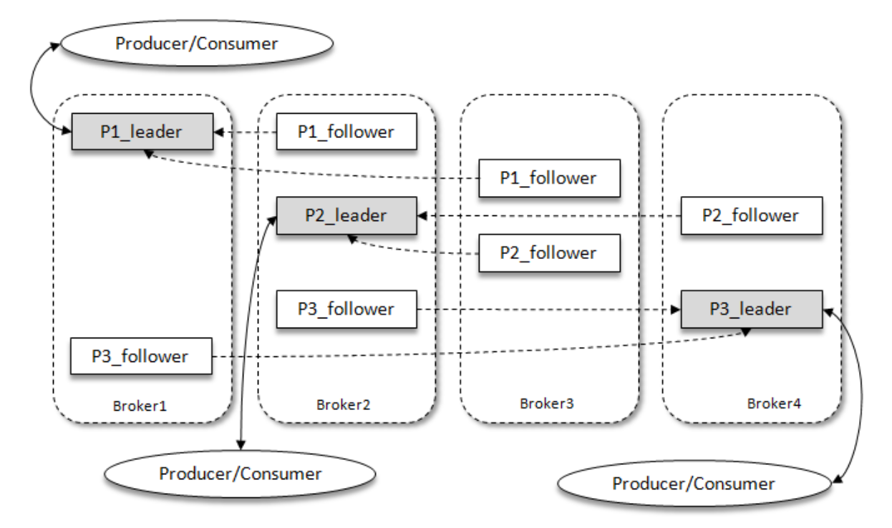

# 初识Kafka

-----

[TOC]

-----

Kafka是由Linkedin采用Scala开发的一个**多分区、多副本、基于ZooKeeper协调**的分布式消息系统，后被捐献给Apache基金会并开源。

目前Kafka已经定位为一个分布式流式处理平台，具有**高吞吐、可持久化、可水平拓展、支持流数据处理**等多种特性。

三大角色：

- **消息系统**：Kafka具有传统消息系统所具备的解耦、冗余存储、流量削峰、缓冲、异步通信、可扩展、可恢复等功能，并在此基础上提供了大多数消息系统难以实现的消息顺序性保障以及回溯消费的功能。
- **存储系统**：Kafka将消息持久化到磁盘，有效降低了数据丢失的风险。得益于Kafka的消息持久化和多副本机制，我们可以把Kafka作为长期的数据存储系统来使用，只需要将数据保留策略设置为永久即可。
- **流式处理平台**：Kafka不仅为流式处理提供数据，还提供了一个完整的流式处理类库，比如窗口、连接、变换和聚合等操作。

## 1.1 基本概念

典型的Kafka体系架构包含若干个Producer、若干Broker、若干Consumer和一个ZooKeeper集群。

Kafka通过ZooKeeper来负责集群元数据管理，控制器选举等操作。Producer讲消息发送给Broker，Broker负责将收到的消息存储在磁盘中，Consumer负责总Broker中订阅并消费消息。

- Producer：生产者，消息的发送方，负责创建消息并投递到Kafka中。
- Consumer：消费者，消息的接收放，消费者连接到Kafka上，接收消息并进行相应的处理逻辑。
- Broker：服务代理节点。可以简单的看作一个独立的Kafka服务，一个或者多个broker组成一个Kafka集群。

在Kafka中，还有两个概念：主题（Topic）和分区（Partition）。Kafka中的消息以主题为单位进行归类，每一个消息都必须指定一个主题。

主题是一个逻辑上的概念，一个主题又可以分为多个分区，一个分区只属于一个主题，他们是一对多的关系。同一主题下不同分区包含的消息是不同的，在存储层面分区可以理解为一个log文件，当消息被追加到分区log文件时会被分配一个offset偏移量。offset是消息在分区中的唯一标识，Kafka通过offset来保证消息在分区中的顺序。

一条消息被写入Kafka时，会先根据主题选择可以被分配的分区，然后根据分区规则选择存储的分区。分区可以跨broker分布。

Kafka给分区引入了多副本（Replica）机制，该机制保证同一个分区可能会存在多个副本，副本之间是一主多从的关系，唯一的lead副本负责**读写**请求，follower副本负责数据的同步。不同的副本应处于不同的broker中，当某一个broker发生宕机时，Kafka会找到这个broker中的所有的lead分区副本，并在对应的follower副本中进行选举得到新的lead副本对外提供服务。通过这种机制Kafka实现了故障的自动转移。
